

<picture><source media="(max-width: 768px)" srcset="./assets/profile/header-mobile.svg">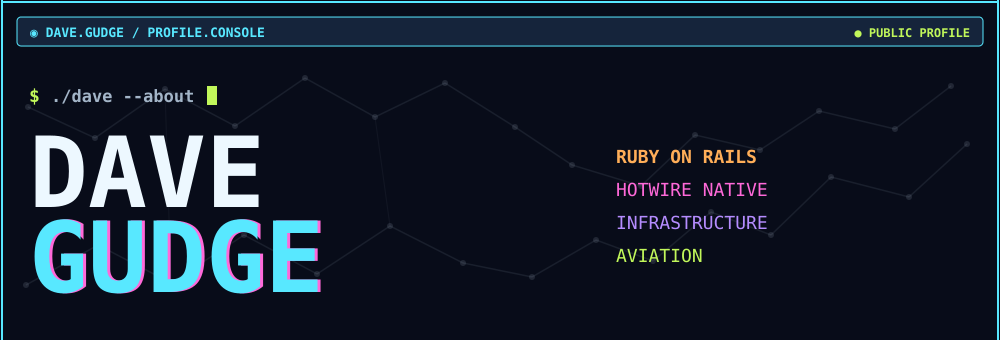</picture>
<picture><source media="(max-width: 768px)" srcset="./assets/profile/stats-mobile.svg">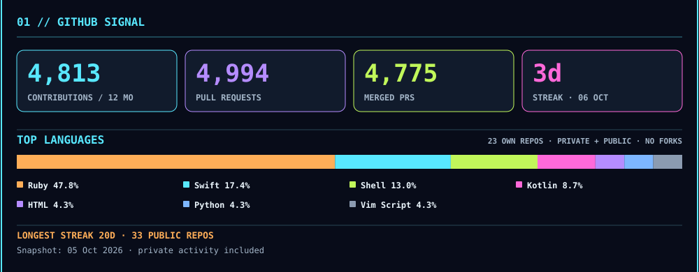</picture>
<picture><source media="(max-width: 768px)" srcset="./assets/profile/contributions-mobile.svg">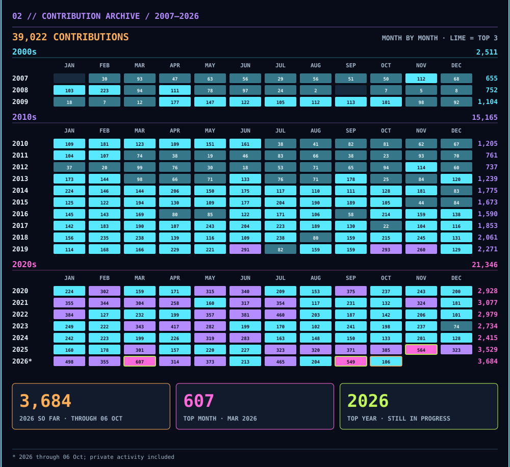</picture>
<picture><source media="(max-width: 768px)" srcset="./assets/profile/smon-mobile.svg">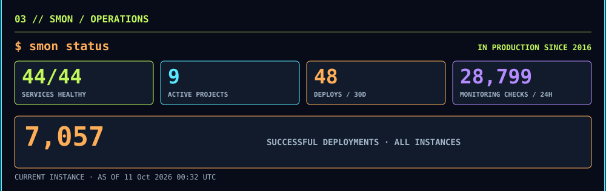</picture>
<picture><source media="(max-width: 768px)" srcset="./assets/profile/adsb-mobile.svg">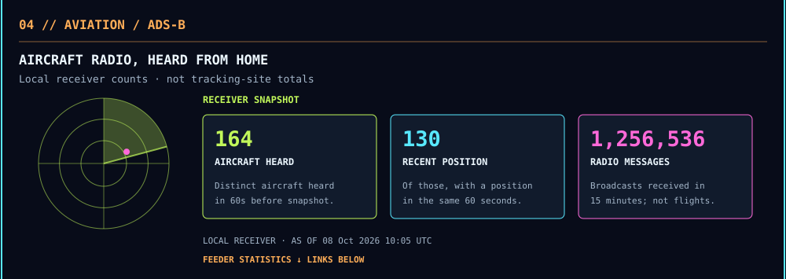</picture>
<a href="https://www.flightaware.com/adsb/stats/user/davegudge"><picture><source media="(max-width: 768px)" srcset="./assets/profile/adsb-link-1-mobile.svg"></picture></a><a href="https://www.flightradar24.com/account/feed-stats/?id=9002"><picture><source media="(max-width: 768px)" srcset="./assets/profile/adsb-link-2-mobile.svg"></picture></a><a href="https://www.adsbexchange.com/api/feeders/?feed=3w4e_osF80-0"><picture><source media="(max-width: 768px)" srcset="./assets/profile/adsb-link-3-mobile.svg"></picture></a>
<picture><source media="(max-width: 768px)" srcset="./assets/profile/projects-mobile.svg"></picture>
<a href="https://smon.gudge.uk"><picture><source media="(max-width: 768px)" srcset="./assets/profile/project-1-mobile.svg">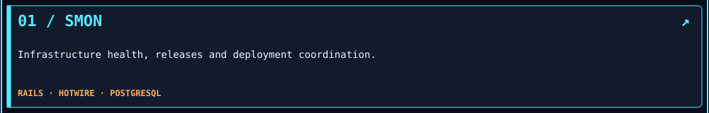</picture></a>
<a href="https://lessons.gudgenet.uk"><picture><source media="(max-width: 768px)" srcset="./assets/profile/project-2-mobile.svg">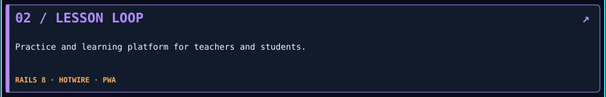</picture></a>
<a href="https://gps-map.gudge.uk"><picture><source media="(max-width: 768px)" srcset="./assets/profile/project-3-mobile.svg">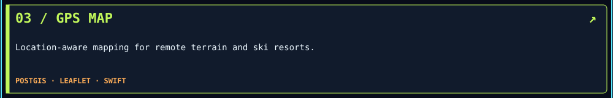</picture></a>
<a href="https://hollykathleen.com"><picture><source media="(max-width: 768px)" srcset="./assets/profile/project-4-mobile.svg">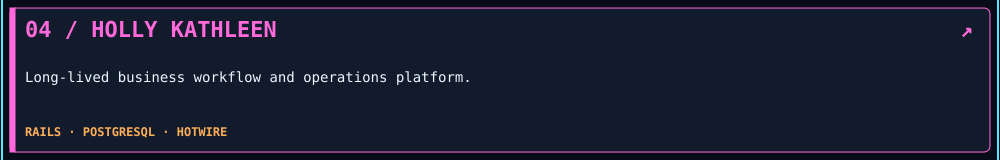</picture></a>
<picture><source media="(max-width: 768px)" srcset="./assets/profile/stack-mobile.svg">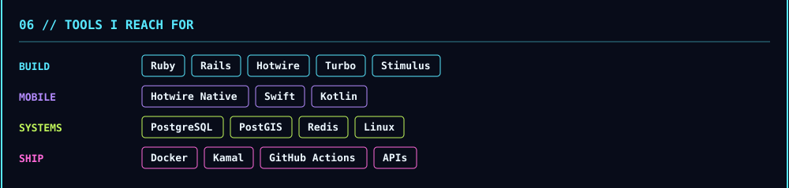</picture>
<picture><source media="(max-width: 768px)" srcset="./assets/profile/footer-mobile.svg">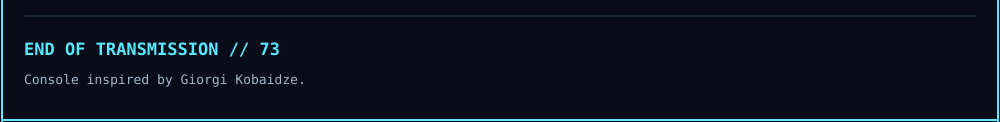</picture>

Work history: <a href="https://www.linkedin.com/in/david-gudge-0b074852/">LinkedIn</a> · Console design inspired by <a href="https://github.com/georgekobaidze/georgekobaidze">Giorgi Kobaidze</a> (<a href="https://dev.to/georgekobaidze/i-turned-my-github-profile-into-a-cyberpunk-console-with-a-city-built-from-my-contributions-h4c">design notes</a>). Responsive SVG approach and vivid accent palette informed by <a href="https://github.com/jdx/jdx">jdx</a>. Operational snapshots refresh on a schedule; GitHub activity is a dated archive.

